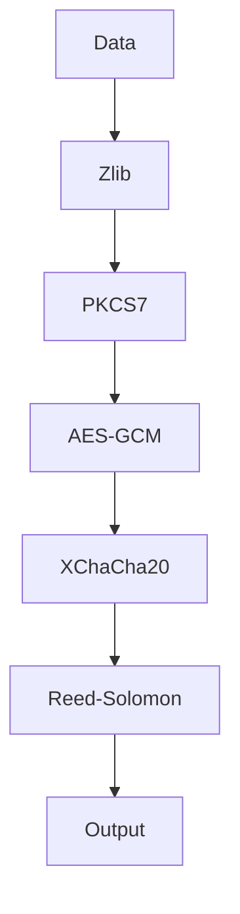
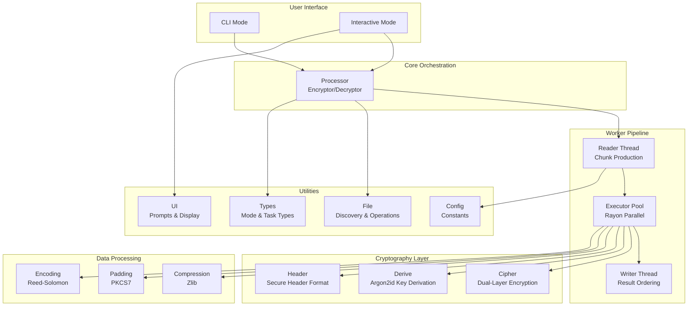

<div align="center">

# SweetByte

**A resilient, secure, and efficient file encryption tool.**

[](https://www.rust-lang.org/)
[](https://opensource.org/licenses/MIT)

</div>

---

### Table of Contents
- [Why SweetByte?](#why-sweetbyte)
- [Core Features](#core-features)
- [How It Works: The Encryption Pipeline](#how-it-works-the-encryption-pipeline)
- [Architecture](#architecture)
- [File Format](#file-format)
- [Usage](#usage)
- [Building from Source](#building-from-source)
- [Module Overview](#module-overview)
- [Security Considerations](#security-considerations)
- [Contributing](#contributing)
- [License](#license)

---

**SweetByte** is a high-security file encryption tool designed for robustness and performance. It safeguards your files using a multi-layered cryptographic pipeline, ensures data integrity with error correction codes, and provides a seamless user experience with both interactive and command-line interfaces.

This is a Rust rewrite of the [original Go implementation](https://github.com/hambosto/sweetbyte), maintaining full file format compatibility while leveraging Rust's memory safety and performance characteristics.

## Why SweetByte?

SweetByte was built with three core principles in mind:

- **Security First:** Security is not just a feature; it's the foundation. By layering best-in-class cryptographic primitives like **AES-256**, **XChaCha20**, and **Argon2id**, SweetByte provides defense-in-depth against a wide range of threats.
- **Extreme Resilience:** Data corruption can render encrypted files useless. SweetByte tackles this head-on by integrating **Reed-Solomon error correction**, giving your files a fighting chance to survive bit rot, transmission errors, or physical media degradation.
- **User-Centric Design:** Powerful security tools should be accessible. With both a guided **interactive mode** for ease of use and a powerful **CLI** for automation, SweetByte caters to all workflows without compromising on functionality.

## Core Features

- **Dual-Algorithm Encryption:** Chains **AES-256-GCM** and **XChaCha20-Poly1305** for a layered defense, combining the AES standard with the modern, high-performance ChaCha20 stream cipher.
- **Strong Key Derivation:** Utilizes **Argon2id**, the winner of the Password Hashing Competition, to protect against brute-force attacks on your password.
- **Resilient File Format:** Integrates **Reed-Solomon error correction codes**, which add redundancy to the data. This allows the file to be successfully decrypted even if it suffers from partial corruption.
- **Tamper-Proof Header:** Each encrypted file includes a secure header that is authenticated with **HMAC-SHA256** using constant-time comparison to prevent tampering and timing attacks.
- **Efficient Streaming:** Processes files in concurrent chunks using crossbeam channels, ensuring low memory usage and high throughput, even for very large files.
- **Dual-Mode Operation:**
    - **Interactive Mode:** A user-friendly, wizard-style interface that guides you through every step.
    - **Command-Line (CLI) Mode:** A powerful and scriptable interface for automation and power users.
- **Secure Deletion:** Offers an option to securely wipe source files after an operation by overwriting them with random data.

## How It Works: The Encryption Pipeline

SweetByte processes data through a sophisticated pipeline to ensure confidentiality, integrity, and resilience.



#### Encryption Flow
When encrypting a file, the data passes through the following stages:

1.  **Zlib Compression:** The raw data is compressed to reduce its size.
2.  **PKCS7 Padding:** The compressed data is padded to a specific block size, a prerequisite for block ciphers.
3.  **AES-256-GCM Encryption:** The padded data is encrypted with AES, the industry standard.
4.  **XChaCha20-Poly1305 Encryption:** The AES-encrypted ciphertext is then encrypted *again* with XChaCha20, adding a second, distinct layer of security.
5.  **Reed-Solomon Encoding:** The final ciphertext is encoded with error correction data, making it resilient to corruption.

This multi-stage process results in a final file that is not only encrypted but also compressed and fortified against data rot.

#### Decryption Flow
Decryption is the exact reverse of the encryption pipeline, unwrapping each layer to securely restore the original data.

## Architecture

SweetByte is designed with a modular, layered architecture that separates concerns and promotes code reuse. The system follows a producer-consumer pattern with three-stage concurrent processing.



### Processing Pipeline

SweetByte uses a three-thread concurrent architecture:

1. **Reader Thread** - Reads input file in chunks, sends tasks via channel
2. **Executor Pool** - Receives tasks, processes in parallel via Rayon work-stealing
3. **Writer Thread** - Receives results, reorders for sequential output, writes to file

The Executor uses `par_bridge()` to convert the sequential channel iterator into a parallel iterator, distributing work across available CPU cores.

### Module Responsibilities

- **User Interfaces:** The `cli` module provides both command-line and interactive modes. Both interfaces build on the `processor` module for high-level orchestration.
- **Core Processing:** The `processor` module provides `Encryptor` and `Decryptor` structs that coordinate the complete encryption/decryption workflow including key derivation, header management, and worker pipeline execution.
- **Worker Pipeline:** The `worker` module implements the three-thread concurrent architecture with `Reader`, `Executor`, and `Writer` components, plus a `Buffer` for result reordering.
- **Cryptographic Layer:** The `cipher` module implements dual-algorithm encryption with `AesGcm` and `ChaCha20Poly1305`, plus `Derive` for Argon2id key derivation. Uses marker types for static dispatch.
- **Header System:** The `header` module provides Reed-Solomon protected headers with HMAC authentication, split across `Serializer`, `Deserializer`, `SectionEncoder`, and `Mac` components.
- **Data Processing:** Dedicated modules for compression (`compression`), padding (`padding`), and error correction (`encoding`).
- **Utilities:** File management (`file`), UI components (`ui`), configuration (`config`), and type definitions (`types`).

## File Format

Encrypted files (`.swx`) have a custom binary structure designed for security and resilience.

#### Overall Structure
An encrypted file consists of a resilient, variable-size header followed by a series of variable-length data chunks.

```
[ Secure Header (variable size) ] [ Chunk 1 ] [ Chunk 2 ] ... [ Chunk N ]
```

#### Secure Header

The header is designed for extreme resilience to withstand data corruption. Instead of a simple, fixed structure, it's a multi-layered, self-verifying format where every component is protected by **Reed-Solomon error correction codes**.

The header layout is:

`[ Lengths Header (16 bytes) ] [ Encoded Length Prefixes (variable) ] [ Encoded Data Sections (variable) ]`

**1. Lengths Header (16 bytes)**

This is the only fixed-size part of the header. It provides the exact encoded size of each of the four main sections (Magic, Salt, HeaderData, and MAC) using big-endian u32 values.

**2. Encoded Length Prefixes (Variable Size)**

Following the lengths header are four Reed-Solomon encoded blocks. Each block encodes the length of its corresponding data section, allowing recovery from corruption.

**3. Encoded Data Sections (Variable Size)**

Each section is individually Reed-Solomon encoded with 4 data shards and 10 parity shards, making each independently recoverable even if partially corrupted.

| Section | Raw Size | Description |
|---------|----------|-------------|
| **Magic Bytes** | 4 bytes | `0xCAFEBABE` - Identifies the file as a SweetByte encrypted file. |
| **Salt** | 32 bytes | Unique random value for Argon2id key derivation. |
| **HeaderData** | 14 bytes | Serialized file metadata (version, flags, original size). |
| **MAC** | 32 bytes | HMAC-SHA256 for integrity and authenticity using constant-time comparison. |

**HeaderData Layout**

| Field | Size | Description |
|-------|------|-------------|
| **Version** | 2 bytes | File format version (currently `0x0001`). |
| **Flags** | 4 bytes | Bitfield of processing options (FLAG_PROTECTED = bit 0). |
| **OriginalSize** | 8 bytes | Original uncompressed file size in bytes. |

#### Cryptographic Parameters

| Parameter | Value | Notes |
|-----------|-------|-------|
| Argon2id time cost | 3 iterations | Balances security vs. usability |
| Argon2id memory | 64 MB | Resists GPU/ASIC attacks |
| Argon2id parallelism | 4 lanes | Efficient multi-threaded hashing |
| Derived key length | 64 bytes | First 32 bytes: encryption, last 32 bytes: HMAC |
| Salt length | 32 bytes | Unique per file, prevents rainbow tables |
| AES-256-GCM key | 32 bytes | Industry-standard authenticated encryption |
| AES-256-GCM nonce | 12 bytes | Randomly generated per encryption |
| XChaCha20-Poly1305 key | 32 bytes | Modern stream cipher |
| XChaCha20-Poly1305 nonce | 24 bytes | Extended nonce for higher throughput |
| HMAC | SHA-256 | 32-byte authentication tag |
| Reed-Solomon data shards | 4 | Input data split into 4 parts |
| Reed-Solomon parity shards | 10 | Recovery capacity for 10 corrupted shards |

#### Data Chunks

Following the header, the file contains encrypted data split into chunks. For encryption, chunks are fixed at 256 KB (except the last chunk). For decryption, each chunk is prefixed with a 4-byte big-endian length field.

```
[ Length (4 bytes, big-endian) ] [ Encrypted & RS-Encoded Data (...) ]
```

The encryption pipeline processes each chunk independently:
1. Compress → Pad → AES-256-GCM → XChaCha20-Poly1305 → Reed-Solomon
[ Chunk Size (4 bytes) ] [ Encrypted & Encoded Data (...) ]
```

## Usage

#### Installation

**From Source:**

```sh
git clone https://github.com/hambosto/sweetbyte-rs.git
cd sweetbyte-rs
cargo build --release
```

The binary will be at `target/release/sweetbyte-rs`.

**Using Cargo:**

```sh
cargo install --path .
```

#### Interactive Mode
For a guided experience, run SweetByte without any commands:

```sh
sweetbyte-rs
```

Or explicitly:

```sh
sweetbyte-rs interactive
```

The interactive prompt will guide you through selecting an operation, choosing files, entering passwords, and handling source files after completion.

#### Command-Line (CLI) Mode
For scripting and automation, use the `encrypt` and `decrypt` commands.

**To Encrypt a File:**
```sh
# Basic encryption (will prompt for password)
sweetbyte-rs encrypt -i document.txt -o document.swx

# Provide password inline
sweetbyte-rs encrypt -i document.txt -o document.swx -p "my-secret-password"

# Auto-derive output path (adds .swx extension)
sweetbyte-rs encrypt -i document.txt
```

**To Decrypt a File:**
```sh
# Basic decryption (will prompt for password)
sweetbyte-rs decrypt -i document.swx -o document.txt

# Provide password inline
sweetbyte-rs decrypt -i document.swx -o document.txt -p "my-secret-password"

# Auto-derive output path (removes .swx extension)
sweetbyte-rs decrypt -i document.swx
```

## Building from Source

SweetByte is built with Rust 2024 edition.

### Prerequisites

- Rust (latest stable recommended)
- Git

### Build Process

```sh
git clone https://github.com/hambosto/sweetbyte-rs.git
cd sweetbyte-rs
cargo build --release
```

The binary will be at `target/release/sweetbyte-rs`.

### Development Commands

```sh
# Format code
cargo fmt

# Check for lints
cargo clippy

# Run tests
cargo test

# Generate documentation
cargo doc --no-deps

# Build with all warnings enabled
cargo build --release --all-features
```

## Module Overview

SweetByte is built with a modular architecture, with each module handling a specific responsibility.

| Module | Description |
|--------|-------------|
| `cipher` | Dual-algorithm encryption using AES-256-GCM and XChaCha20-Poly1305. Implements `Cipher` struct with type-parameterized dispatch via `CipherAlgorithm` trait. Key splitting provides 32 bytes per cipher from 64-byte derived key. |
| `cli` | Command-line interface using `clap` for argument parsing and `dialoguer` for interactive prompts. Provides `encrypt`, `decrypt`, `interactive`, and `completions` commands with input/output path and password options. |
| `compression` | Zlib compression/decompression using `flate2`. Configurable levels (None, Fast, Default, Best); SweetByte uses Fast level for minimal pipeline overhead. |
| `config` | Application-wide constants including `FILE_EXTENSION` (`.swx`), `EXCLUDED_PATTERNS`, cryptographic parameters (Argon2id, AES, ChaCha20), and chunk sizes. |
| `encoding` | Reed-Solomon error correction using `reed_solomon_erasure`. Implements 4 data shards + 10 parity shards for recovery from up to 10 corrupted shards. Handles shard splitting, parity computation, and reconstruction. |
| `file` | File discovery using `walkdir` with glob pattern exclusion. `File` struct wraps `PathBuf` with methods for size caching, eligibility checking, output path generation, and validation. |
| `header` | Secure header format with Reed-Solomon protection and HMAC authentication. Submodules: `serializer` (binary format assembly), `deserializer` (parsing with error correction), `section` (section encoding), `mac` (constant-time HMAC-SHA256). |
| `padding` | PKCS7 padding with configurable block size (128 bytes). Ensures plaintext length is multiple of block size for block cipher compatibility. |
| `processor` | High-level orchestration via `Encryptor` and `Decryptor` structs. Coordinates key derivation, header creation/verification, and worker pipeline execution. |
| `worker` | Concurrent three-thread pipeline using `flume` channels and `rayon` parallelism. Components: `Reader` (chunk production), `Executor` (parallel processing via `par_bridge`), `Writer` (ordered output), `Buffer` (result reordering), `Pipeline` (per-chunk encryption/decryption). |
| `types` | Core type definitions including `ProcessorMode` (Encrypt/Decrypt), `Processing` (operation state), `Task` (chunk with index), `TaskResult` (processed data or error). |
| `ui` | User interface components using `indicatif` for progress bars, `comfy-table` for file info display, `figlet-rs` for ASCII art banners, and `dialoguer` for interactive prompts. Submodules: `display`, `progress`, `prompt`. |

## Differences from the Go Version

This Rust port maintains full file format compatibility with the Go version while leveraging Rust's unique strengths:

- **Memory Safety:** Compile-time borrow checking eliminates data races and use-after-free bugs without garbage collection overhead.
- **Type System:** Marker types (`Algorithm::Aes256Gcm`, `Algorithm::XChaCha20Poly1305`) enable static dispatch for cipher selection, avoiding runtime trait object overhead.
- **Concurrency:** Uses `flume` channels for producer-consumer communication and `rayon` for parallel processing via `par_bridge()`, distributing work across CPU cores.
- **Error Handling:** Uses `anyhow` for ergonomic error propagation with full context chaining; native byte order conversion via `to_be_bytes()`/`from_be_bytes()`.
- **Zero-Cost Abstractions:** Inline functions, const generics, and iterator adapters compile away to efficient machine code.

Files encrypted with the Go version can be decrypted with the Rust version and vice versa. The file format is identical.

## Security Considerations

SweetByte is designed with a strong focus on security. However, keep the following in mind:

- **Password Strength:** The security of your encrypted files depends heavily on password strength. Use long, complex, unique passwords.
- **Secure Environment:** Run SweetByte in a secure environment. Compromised systems can capture passwords.
- **Source File Deletion:** Secure deletion depends on hardware and filesystem. SSD wear leveling and journaling filesystems may retain data.
- **Side-Channel Attacks:** Constant-time comparison is used for MAC verification, but this tool is not hardened against all side-channel attacks.

## Shell Completions

Generate shell completion scripts for your shell:

```sh
# Bash
sweetbyte-rs completions bash >> ~/.bashrc

# Zsh
sweetbyte-rs completions zsh >> ~/.zshrc

# Fish
sweetbyte-rs completions fish > ~/.config/fish/completions/sweetbyte-rs.fish
```

## Contributing

Contributions are welcome. For major changes, please open an issue first to discuss the approach.

Before submitting a pull request:

```sh
cargo fmt
cargo clippy
cargo test
cargo doc --no-deps
```

Ensure all checks pass with no warnings.

## License

This project is licensed under the [MIT License](LICENSE).
