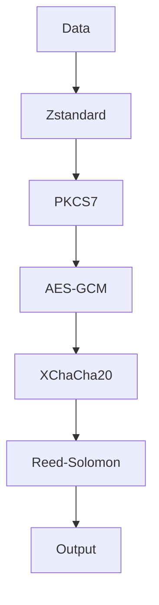
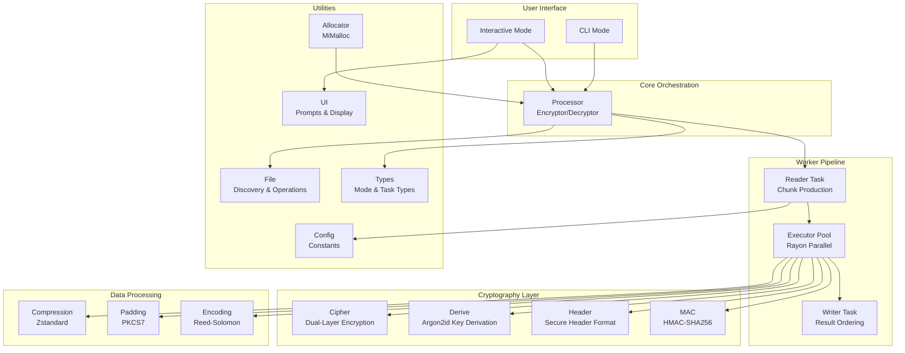

<div align="center">

# SweetByte

**A resilient, secure, and efficient file encryption tool.**

[](https://www.rust-lang.org/)
[](https://opensource.org/licenses/MIT)

</div>

---

### Table of Contents
- [Why SweetByte?](#why-sweetbyte)
- [Incompatibility Notice](#incompatibility-notice)
- [Core Features](#core-features)
- [How It Works: The Encryption Pipeline](#how-it-works-the-encryption-pipeline)
- [Architecture](#architecture)
- [File Format](#file-format)
- [Usage](#usage)
- [Building from Source](#building-from-source)
- [Module Overview](#module-overview)
- [Security Considerations](#security-considerations)
- [Contributing](#contributing)
- [License](#license)

---

**SweetByte** is a high-security file encryption tool designed for robustness and performance. It safeguards your files using a multi-layered cryptographic pipeline, ensures data integrity with error correction codes, and provides a seamless user experience with both interactive and command-line interfaces.

This is a complete **Rust rewrite** of the [original Go implementation](https://github.com/hambosto/sweetbyte). It leverages Rust's memory safety, concurrency model, and type system to provide a more robust and performant tool.

## Why SweetByte?

SweetByte was built with three core principles in mind:

- **Security First:** Security is not just a feature; it's the foundation. By layering best-in-class cryptographic primitives like **AES-256-GCM**, **XChaCha20-Poly1305**, **Argon2id**, and **BLAKE3**, SweetByte provides defense-in-depth against a wide range of threats.
- **Extreme Resilience:** Data corruption can render encrypted files useless. SweetByte tackles this head-on by integrating **Reed-Solomon error correction**, giving your files a fighting chance to survive bit rot, transmission errors, or physical media degradation.
- **User-Centric Design:** Powerful security tools should be accessible. With both a guided **interactive mode** for ease of use and a powerful **CLI** for automation, SweetByte caters to all workflows without compromising on functionality.

## Incompatibility Notice

**⚠️ Important:** This Rust version (v2 format) is **NOT compatible** with files encrypted by the original Go version (v1 format).

Files encrypted with the Go version **cannot** be decrypted by this tool, and vice-versa. The file format has been significantly improved to include:

1.  **Enhanced Metadata Protection:** A dedicated, Reed-Solomon protected metadata section containing the original filename, file size, and content hash.
2.  **Stronger Integrity Checks:** Integration of **BLAKE3** hashing for content integrity verification, in addition to HMAC-SHA256 for header authentication.
3.  **Format Hardening:** Updated magic bytes (`0xDEADBEEF`) and versioning (`0x0002`) to prevent accidental processing of incompatible files.

## Core Features

- **Dual-Algorithm Encryption:** Chains **AES-256-GCM** and **XChaCha20-Poly1305** for a layered defense, combining the AES standard with the modern, high-performance ChaCha20 stream cipher.
- **Strong Key Derivation:** Utilizes **Argon2id**, the winner of the Password Hashing Competition, to protect against brute-force attacks on your password.
- **Resilient File Format:** Integrates **Reed-Solomon error correction codes**, which add redundancy to the data. This allows the file to be successfully decrypted even if it suffers from partial corruption (up to 10 parity shards per 4 data shards).
- **Tamper-Proof Header:** Each encrypted file includes a secure header that is authenticated with **HMAC-SHA256** using constant-time comparison to prevent tampering and timing attacks.
- **Content Integrity:** Calculates and verifies a **BLAKE3** hash of the original file content to ensure 100% data integrity after decryption.
- **Efficient Streaming:** Processes files in concurrent chunks using a multi-threaded pipeline, ensuring low memory usage and high throughput, even for very large files.
- **Dual-Mode Operation:**
    - **Interactive Mode:** A user-friendly, wizard-style interface that guides you through every step.
    - **Command-Line (CLI) Mode:** A powerful and scriptable interface for automation and power users.
- **Secure Deletion:** Offers an option to securely wipe source files after an operation by overwriting them with random data (interactive mode).
- **High-Performance Memory:** Uses MiMalloc for improved memory allocation performance and security properties.

## How It Works: The Encryption Pipeline

SweetByte processes data through a sophisticated pipeline to ensure confidentiality, integrity, and resilience.



#### Encryption Flow
When encrypting a file, the data passes through the following stages:

1.  **Zstandard Compression:** The raw data is compressed to reduce its size.
2.  **PKCS7 Padding:** The compressed data is padded to a specific block size (128 bytes), a prerequisite for block ciphers.
3.  **AES-256-GCM Encryption:** The padded data is encrypted with AES, the industry standard.
4.  **XChaCha20-Poly1305 Encryption:** The AES-encrypted ciphertext is then encrypted *again* with XChaCha20, adding a second, distinct layer of security.
5.  **Reed-Solomon Encoding:** The final ciphertext is encoded with error correction data, making it resilient to corruption.

This multi-stage process results in a final file that is not only encrypted but also compressed and fortified against data rot.

#### Decryption Flow
Decryption is the exact reverse of the encryption pipeline, unwrapping each layer to securely restore the original data. Finally, the **BLAKE3** hash of the restored data is verified against the hash stored in the secure header.

## Architecture

SweetByte is designed with a modular, layered architecture that separates concerns and promotes code reuse. The system follows a producer-consumer pattern with three-stage concurrent processing powered by Tokio async runtime and Rayon parallel processing.



### Processing Pipeline

SweetByte uses a three-stage concurrent architecture powered by Tokio async runtime and Rayon parallel processing:

1. **Reader Stage (Tokio Task)** - Reads input file in chunks asynchronously, sends tasks via bounded flume channel.
2. **Executor Stage (Blocking Rayon Pool)** - Receives tasks, processes in parallel via `par_bridge()` converting channel iterator to parallel iterator.
3. **Writer Stage (Tokio Task)** - Receives results via flume channel, reorders for sequential output using HashMap buffer, writes to file.

The Executor spawns blocking tasks on `tokio::task::spawn_blocking()` for CPU-intensive crypto operations while distributing work across available CPU cores using Rayon's work-stealing scheduler.

## File Format

Encrypted files (`.swx`) have a custom binary structure designed for security and resilience.

#### Overall Structure
An encrypted file consists of a resilient, variable-size header followed by a series of variable-length data chunks.

```
[ Secure Header (variable size) ] [ Chunk 1 ] [ Chunk 2 ] ... [ Chunk N ]
```

#### Secure Header

The header is designed for extreme resilience to withstand data corruption. It uses a multi-layered, self-verifying format where every component is protected by **Reed-Solomon error correction codes**.

The header layout is:

`[ Lengths Header (20 bytes) ] [ Encoded Length Prefixes (variable) ] [ Encoded Data Sections (variable) ]`

**1. Lengths Header (20 bytes)**

This is the only fixed-size part of the header. It provides the exact encoded size of each of the **five** main sections (Magic, Salt, HeaderData, Metadata, and MAC) using big-endian u32 values.

**2. Encoded Length Prefixes (Variable Size)**

Following the lengths header are five Reed-Solomon encoded blocks. Each block encodes the length of its corresponding data section, allowing recovery from corruption.

**3. Encoded Data Sections (Variable Size)**

Each section is individually Reed-Solomon encoded with 4 data shards and 10 parity shards, making each independently recoverable even if partially corrupted.

| Section | Raw Size | Description |
|---------|----------|-------------|
| **Magic Bytes** | 4 bytes | `0xDEADBEEF` - Identifies the file as a SweetByte v2 encrypted file. |
| **Salt** | 32 bytes | Unique random salt for Argon2id key derivation. |
| **HeaderData** | 12 bytes | Serialized encryption and compression parameters (Version, Algorithm, etc.). |
| **Metadata** | Variable | Contains original filename, file size, and **BLAKE3** content hash (32 bytes). |
| **MAC** | 32 bytes | **HMAC-SHA256** for header integrity and authenticity. |

**HeaderData Layout (12 bytes)**

| Field | Size | Description |
|-------|------|-------------|
| **Version** | 2 bytes | File format version (currently `0x0002`). |
| **Algorithm** | 1 byte | Cipher identifier (AES-256-GCM \| XChaCha20-Poly1305). |
| **Compression** | 1 byte | Compression algorithm (Zstandard). |
| **Encoding** | 1 byte | Error correction algorithm (Reed-Solomon). |
| **KDF** | 1 byte | Key derivation function (Argon2id). |
| **KDF Memory** | 4 bytes | Argon2 memory cost (64 MB = 65536 KB). |
| **KDF Time** | 1 byte | Argon2 time cost (3 iterations). |
| **KDF Parallelism** | 1 byte | Argon2 threads (4 lanes). |

#### Cryptographic Parameters

| Parameter | Value | Notes |
|-----------|-------|-------|
| Argon2id time cost | 3 iterations | Balances security vs. usability |
| Argon2id memory | 64 MB | Resists GPU/ASIC attacks |
| Argon2id parallelism | 4 lanes | Efficient multi-threaded hashing |
| Derived key length | 64 bytes | Split into 32B for encryption, 32B for HMAC |
| Salt length | 32 bytes | Unique per file, prevents rainbow tables |
| AES-256-GCM key | 32 bytes | Industry-standard authenticated encryption |
| AES-256-GCM nonce | 12 bytes | Randomly generated per encryption |
| XChaCha20-Poly1305 key | 32 bytes | Modern stream cipher |
| XChaCha20-Poly1305 nonce | 24 bytes | Extended nonce for higher throughput |
| HMAC | SHA-256 | 32-byte authentication tag for header |
| Content Hash | BLAKE3 | 32-byte hash for file content integrity |
| Reed-Solomon data shards | 4 | Input data split into 4 parts |
| Reed-Solomon parity shards | 10 | Recovery capacity for 10 corrupted shards |

#### Data Chunks

Following the header, the file contains encrypted data split into chunks. Chunks are processed in fixed-size segments (default 256 KB, minimum 256 KB enforced). For encryption, chunks are read at the configured size. For decryption, each chunk is prefixed with a 4-byte big-endian length field.

```
[ Length (4 bytes, big-endian) ] [ Encrypted & RS-Encoded Data (...) ]
```

The encryption pipeline processes each chunk independently:
1. Compress → Pad → AES-256-GCM → XChaCha20-Poly1305 → Reed-Solomon

## Usage

#### Installation

**Using Nix (Recommended):**

```sh
# Run directly without installation
nix run github:hambosto/sweetbyte-rs

# Or enter development shell with sweetbyte-rs available
nix develop github:hambosto/sweetbyte-rs

# Build and install from source flake
nix profile install github:hambosto/sweetbyte-rs
```

**From Source:**

```sh
git clone https://github.com/hambosto/sweetbyte-rs.git
cd sweetbyte-rs
cargo build --release
```

The binary will be at `target/release/sweetbyte-rs`.

**Using Cargo:**

```sh
cargo install --path .
```

#### Interactive Mode
For a guided experience, run SweetByte without any commands:

```sh
sweetbyte-rs
```

Or explicitly:

```sh
sweetbyte-rs interactive
```

The interactive prompt will guide you through selecting an operation, choosing files, entering passwords, and handling source files after completion.

#### Command-Line (CLI) Mode
For scripting and automation, use the `encrypt` and `decrypt` commands.

**To Encrypt a File:**
```sh
# Basic encryption (will prompt for password)
sweetbyte-rs encrypt -i document.txt -o document.swx

# Provide password inline (not recommended for secure environments)
sweetbyte-rs encrypt -i document.txt -o document.swx -p "my-secret-password"

# Auto-derive output path (adds .swx extension)
sweetbyte-rs encrypt -i document.txt
```

**To Decrypt a File:**
```sh
# Basic decryption (will prompt for password)
sweetbyte-rs decrypt -i document.swx -o document.txt

# Provide password inline
sweetbyte-rs decrypt -i document.swx -o document.txt -p "my-secret-password"

# Auto-derive output path (removes .swx extension)
sweetbyte-rs decrypt -i document.swx
```

## Building from Source

SweetByte is built with Rust 2024 edition.

### Prerequisites

- Rust (latest stable recommended)
- Git
- **For Nix:** Nix with flakes enabled

### Build Process

#### Using Cargo

```sh
git clone https://github.com/hambosto/sweetbyte-rs.git
cd sweetbyte-rs
cargo build --release
```

The binary will be at `target/release/sweetbyte-rs`.

#### Using Nix

```sh
# Clone and enter directory
git clone https://github.com/hambosto/sweetbyte-rs.git
cd sweetbyte-rs

# Build the package
nix build

# Run the built binary
./result/bin/sweetbyte-rs

# Or install to your user profile
nix profile install ./result
```

#### Development Shell

Enter a development environment with all dependencies:

```sh
nix develop
```

This provides Rust toolchain, clippy, rustfmt, and rust-analyzer.

### Development Commands

```sh
# Format code
cargo fmt

# Check for lints
cargo clippy

# Run tests
cargo test

# Generate documentation
cargo doc --no-deps
```

## Module Overview

SweetByte is built with a modular architecture, with each module handling a specific responsibility.

| Module | Description |
|--------|-------------|
| `allocator` | MiMalloc high-performance global memory allocator. |
| `app` | CLI application using `clap` for command parsing and `inquire` for interactive prompts. Handles `encrypt`, `decrypt`, and `interactive` commands. |
| `cipher` | Dual-algorithm encryption combining `aes-gcm` (AES-256-GCM) and `chacha20poly1305` (XChaCha20-Poly1305). Implements `Mac` trait for HMAC-SHA256 header authentication. |
| `compression` | Zstandard compression/decompression using `zstd` with configurable compression levels. |
| `config` | Application constants: `MAGIC_BYTES` (`0xDEADBEEF`), `VERSION` (`0x0002`), crypto parameters (Argon2id: 64MB memory, 3 iterations, 4 lanes), chunk size (256KB), RS shards (4 data + 10 parity). |
| `encoding` | Reed-Solomon error correction using `reed-solomon-simd` with CRC32 checksums for data integrity verification. |
| `file` | File discovery using `walkdir`, BLAKE3 hashing, path validation, and secure file operations with exclusion patterns. |
| `header` | Secure header management with Reed-Solomon protected sections. Submodules: `parameter` (magic/version validation), `metadata` (filename, size, BLAKE3 content hash), `section` (length-prefixed encoded sections). |
| `padding` | PKCS7 padding implementation using `block-padding` with configurable block sizes (128-byte default). |
| `processor` | Core orchestrator managing key derivation, header creation/validation, and worker pipeline execution. |
| `types` | Core type definitions: `Processing` (Encryption/Decryption), `ProcessorMode`, `Task`, `TaskResult`. |
| `ui` | User interface components: `progress` (indicatif progress bars), `prompt` (inquire-based interactive prompts), display utilities with `comfy-table` and `figlet-rs`. |
| `worker` | Three-stage concurrent pipeline architecture. Submodules: `reader` (chunk producer), `executor` (Rayon parallel processor), `writer` (ordered results writer), `buffer` (reordering buffer), `pipeline` (crypto/compression/encoding pipeline). |

## Security Considerations

SweetByte is designed with a strong focus on security. However, keep the following in mind:

- **Password Strength:** The security of your encrypted files depends heavily on password strength. Use long, complex, unique passwords.
- **Secure Environment:** Run SweetByte in a secure environment. Compromised systems can capture passwords.
- **Source File Deletion:** Secure deletion depends on hardware and filesystem. SSD wear leveling and journaling filesystems may retain data.
- **Side-Channel Attacks:** Constant-time comparison is used for MAC verification, but this tool is not hardened against all side-channel attacks.
- **Memory Allocation:** Uses MiMalloc for improved memory performance and security properties.

## Contributing

Contributions are welcome. For major changes, please open an issue first to discuss the approach.

Before submitting a pull request:

```sh
# Using Cargo
cargo fmt
cargo clippy
cargo test
cargo doc --no-deps

# Or using Nix for development environment
nix develop
cargo fmt && cargo clippy && cargo test && cargo doc --no-deps
```

Ensure all checks pass with no warnings.

## License

This project is licensed under the [MIT License](LICENSE).
