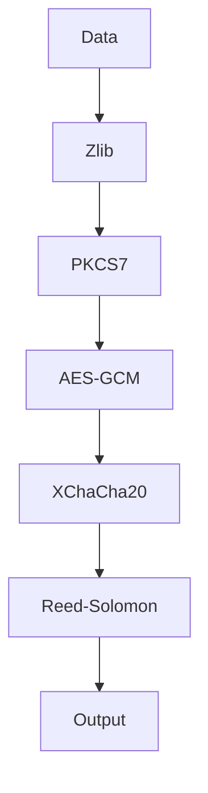
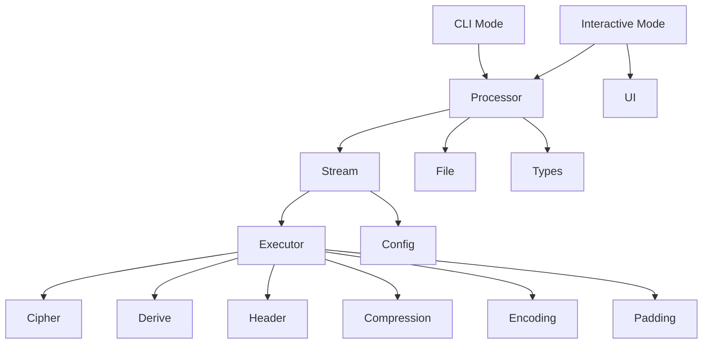

<div align="center">

# SweetByte

**A resilient, secure, and efficient file encryption tool.**

[](https://www.rust-lang.org/)
[](https://opensource.org/licenses/MIT)

</div>

---

### Table of Contents
- [Why SweetByte?](#why-sweetbyte)
- [Core Features](#core-features)
- [How It Works: The Encryption Pipeline](#how-it-works-the-encryption-pipeline)
- [Architecture](#architecture)
- [File Format](#file-format)
- [Usage](#usage)
- [Building from Source](#building-from-source)
- [Module Overview](#module-overview)
- [Security Considerations](#security-considerations)
- [Contributing](#contributing)
- [License](#license)

---

**SweetByte** is a high-security file encryption tool designed for robustness and performance. It safeguards your files using a multi-layered cryptographic pipeline, ensures data integrity with error correction codes, and provides a seamless user experience with both interactive and command-line interfaces.

This is a Rust rewrite of the [original Go implementation](https://github.com/hambosto/sweetbyte), maintaining full file format compatibility while leveraging Rust's memory safety and performance characteristics.

## Why SweetByte?

SweetByte was built with three core principles in mind:

- **Security First:** Security is not just a feature; it's the foundation. By layering best-in-class cryptographic primitives like **AES-256**, **XChaCha20**, and **Argon2id**, SweetByte provides defense-in-depth against a wide range of threats.
- **Extreme Resilience:** Data corruption can render encrypted files useless. SweetByte tackles this head-on by integrating **Reed-Solomon error correction**, giving your files a fighting chance to survive bit rot, transmission errors, or physical media degradation.
- **User-Centric Design:** Powerful security tools should be accessible. With both a guided **interactive mode** for ease of use and a powerful **CLI** for automation, SweetByte caters to all workflows without compromising on functionality.

## Core Features

- **Dual-Algorithm Encryption:** Chains **AES-256-GCM** and **XChaCha20-Poly1305** for a layered defense, combining the AES standard with the modern, high-performance ChaCha20 stream cipher.
- **Strong Key Derivation:** Utilizes **Argon2id**, the winner of the Password Hashing Competition, to protect against brute-force attacks on your password.
- **Resilient File Format:** Integrates **Reed-Solomon error correction codes**, which add redundancy to the data. This allows the file to be successfully decrypted even if it suffers from partial corruption.
- **Tamper-Proof Header:** Each encrypted file includes a secure header that is authenticated with **HMAC-SHA256** using constant-time comparison to prevent tampering and timing attacks.
- **Efficient Streaming:** Processes files in concurrent chunks using crossbeam channels, ensuring low memory usage and high throughput, even for very large files.
- **Dual-Mode Operation:**
    - **Interactive Mode:** A user-friendly, wizard-style interface that guides you through every step.
    - **Command-Line (CLI) Mode:** A powerful and scriptable interface for automation and power users.
- **Secure Deletion:** Offers an option to securely wipe source files after an operation by overwriting them with random data.

## How It Works: The Encryption Pipeline

SweetByte processes data through a sophisticated pipeline to ensure confidentiality, integrity, and resilience.



#### Encryption Flow
When encrypting a file, the data passes through the following stages:

1.  **Zlib Compression:** The raw data is compressed to reduce its size.
2.  **PKCS7 Padding:** The compressed data is padded to a specific block size, a prerequisite for block ciphers.
3.  **AES-256-GCM Encryption:** The padded data is encrypted with AES, the industry standard.
4.  **XChaCha20-Poly1305 Encryption:** The AES-encrypted ciphertext is then encrypted *again* with XChaCha20, adding a second, distinct layer of security.
5.  **Reed-Solomon Encoding:** The final ciphertext is encoded with error correction data, making it resilient to corruption.

This multi-stage process results in a final file that is not only encrypted but also compressed and fortified against data rot.

#### Decryption Flow
Decryption is the exact reverse of the encryption pipeline, unwrapping each layer to securely restore the original data.

## Architecture

SweetByte is designed with a modular, layered architecture that separates concerns and promotes code reuse.



- **User Interfaces:** The `cli` module provides both command-line and interactive modes for users to interact with the application. Both interfaces are built on top of the `processor` module.
- **Core Logic:** The `processor`, `stream`, and `executor` modules form the core of the application. The `processor` module orchestrates the high-level workflow, the `stream` module handles concurrent chunk-based file processing with crossbeam channels.
- **Cryptographic & Data Processing:** This layer contains the modules that implement the cryptographic and data processing primitives. These modules are responsible for encryption, key derivation, header serialization, compression, error correction, and padding.
- **Utilities & Support:** This layer provides utility and support modules for file management, UI components, configuration, and type definitions.

## File Format

Encrypted files (`.swx`) have a custom binary structure designed for security and resilience.

#### Overall Structure
An encrypted file consists of a resilient, variable-size header followed by a series of variable-length data chunks.

```
[ Secure Header (variable size) ] [ Chunk 1 ] [ Chunk 2 ] ... [ Chunk N ]
```

#### Secure Header
The header is designed for extreme resilience to withstand data corruption. Instead of a simple, fixed structure, it's a multi-layered, self-verifying format where every component is protected by **Reed-Solomon error correction codes**.

The header is composed of three main parts:

`[ Lengths Header (16 bytes) ] [ Encoded Length Prefixes (variable) ] [ Encoded Data Sections (variable) ]`

**1. Lengths Header (16 bytes)**

This is the only fixed-size part of the header. It provides the exact size of the encoded length prefix for each of the four main sections (Magic, Salt, Header Data, and MAC).

**2. Encoded Length Prefixes (Variable Size)**

Following the lengths header are four variable-size blocks. Each block is a Reed-Solomon encoded value that, when decoded, reveals the size of the corresponding encoded data section.

**3. Encoded Data Sections (Variable Size)**

This is the core of the header, containing the actual metadata. Each section is individually encoded with Reed-Solomon, making it independently recoverable.

| Section         | Raw Size | Description                                                                                   |
|-----------------|----------|-----------------------------------------------------------------------------------------------|
| **Magic Bytes**   | 4 bytes  | `0xCAFEBABE` - Identifies the file as a SweetByte encrypted file.                             |
| **Salt**          | 32 bytes | Unique random value for Argon2id key derivation.                                              |
| **Header Data**   | 14 bytes | Serialized file metadata (version, flags, original size).                                     |
| **MAC**           | 32 bytes | HMAC-SHA256 for integrity and authenticity of the raw header sections.                        |

**Header Data Layout**

| Field          | Size     | Description                                                      |
|----------------|----------|------------------------------------------------------------------|
| **Version**      | 2 bytes  | File format version (currently `0x0001`).                        |
| **Flags**        | 4 bytes  | Bitfield of processing options.                                  |
| **OriginalSize** | 8 bytes  | Original uncompressed file size.                                 |

#### Cryptographic Parameters

| Parameter | Value |
|-----------|-------|
| Argon2id time cost | 3 |
| Argon2id memory | 64 KB |
| Argon2id parallelism | 4 |
| Key length | 64 bytes (split between ciphers) |
| Salt length | 32 bytes |
| AES nonce | 12 bytes |
| XChaCha20 nonce | 24 bytes |
| Reed-Solomon data shards | 4 |
| Reed-Solomon parity shards | 10 |

#### Data Chunks
Following the header, the file contains the encrypted data split into chunks. Each chunk is prefixed with a 4-byte big-endian length header.

```
[ Chunk Size (4 bytes) ] [ Encrypted & Encoded Data (...) ]
```

## Usage

#### Installation

**From Source:**

```sh
git clone https://github.com/hambosto/sweetbyte-rs.git
cd sweetbyte-rs
cargo build --release
```

The binary will be at `target/release/sweetbyte-rs`.

**Using Cargo:**

```sh
cargo install --path .
```

#### Interactive Mode
For a guided experience, run SweetByte without any commands:

```sh
sweetbyte-rs
```

Or explicitly:

```sh
sweetbyte-rs interactive
```

The interactive prompt will guide you through selecting an operation, choosing files, entering passwords, and handling source files after completion.

#### Command-Line (CLI) Mode
For scripting and automation, use the `encrypt` and `decrypt` commands.

**To Encrypt a File:**
```sh
# Basic encryption (will prompt for password)
sweetbyte-rs encrypt -i document.txt -o document.swx

# Provide password inline
sweetbyte-rs encrypt -i document.txt -o document.swx -p "my-secret-password"

# Auto-derive output path (adds .swx extension)
sweetbyte-rs encrypt -i document.txt
```

**To Decrypt a File:**
```sh
# Basic decryption (will prompt for password)
sweetbyte-rs decrypt -i document.swx -o document.txt

# Provide password inline
sweetbyte-rs decrypt -i document.swx -o document.txt -p "my-secret-password"

# Auto-derive output path (removes .swx extension)
sweetbyte-rs decrypt -i document.swx
```

## Building from Source

SweetByte is built with Rust 2024 edition.

### Prerequisites
- Rust 1.85 or higher
- Git

### Build Process

```sh
git clone https://github.com/hambosto/sweetbyte-rs.git
cd sweetbyte-rs
cargo build --release
```

### Cross-Compilation

```sh
# Build for Windows
cargo build --release --target x86_64-pc-windows-msvc

# Build for Linux
cargo build --release --target x86_64-unknown-linux-gnu

# Build for macOS
cargo build --release --target x86_64-apple-darwin
```

### Running Tests

```sh
cargo test
```

The test suite includes 71 tests covering roundtrip encryption/decryption, wrong-password rejection, and component unit tests.

## Module Overview

SweetByte is built with a modular architecture, with each module handling a specific responsibility.

| Module           | Description                                                              |
|------------------|--------------------------------------------------------------------------|
| `cipher`         | Implements AES-256-GCM and XChaCha20-Poly1305 encryption with proper nonce generation and authenticated encryption. Manages both ciphers for layered encryption. |
| `cli`            | Command-line interface using clap. Provides `encrypt`, `decrypt`, and `interactive` commands with flags for input/output paths and passwords. |
| `compression`    | Zlib compression and decompression with configurable compression levels. |
| `config`         | Application-wide constants including file extension, exclusion patterns, and cryptographic parameters. |
| `encoding`       | Reed-Solomon error correction with 4 data shards and 10 parity shards. Handles splitting, combining, and recovering data from potentially corrupted shards. |
| `file`           | File discovery, path validation, and file operations. Handles finding eligible files and creating output paths. |
| `header`         | Serialization, deserialization, and verification of the secure file header. Includes Reed-Solomon protection and HMAC authentication with constant-time comparison. |
| `padding`        | PKCS7 padding with configurable block size. |
| `processor`      | High-level encrypt/decrypt orchestration. Coordinates between modules to execute the complete pipeline. |
| `stream`         | Concurrent chunk-based file processing using crossbeam channels. Includes buffered reading, sequential writing, and a thread pool executor. |
| `types`          | Common type definitions including processing modes and task structures. |
| `ui`             | User interface components: progress bars with indicatif, file info display with comfy-table, and user prompts with dialoguer. |

## Differences from the Go Version

This Rust port maintains full file format compatibility with the Go version while leveraging Rust's strengths:

- **Memory Safety:** Compile-time guarantees without garbage collection overhead.
- **Performance:** Zero-cost abstractions and efficient concurrent processing with crossbeam.
- **Error Handling:** Uses `anyhow` for ergonomic error propagation with full context.
- **Native Byte Order:** Uses Rust's built-in `to_be_bytes()` and `from_be_bytes()` instead of external crates.

Files encrypted with the Go version can be decrypted with the Rust version and vice versa.

## Security Considerations

SweetByte is designed with a strong focus on security. However, keep the following in mind:

- **Password Strength:** The security of your encrypted files depends heavily on password strength. Use long, complex, unique passwords.
- **Secure Environment:** Run SweetByte in a secure environment. Compromised systems can capture passwords.
- **Source File Deletion:** Secure deletion depends on hardware and filesystem. SSD wear leveling and journaling filesystems may retain data.
- **Side-Channel Attacks:** Constant-time comparison is used for MAC verification, but this tool is not hardened against all side-channel attacks.

## Contributing

Contributions are welcome. For major changes, please open an issue first to discuss the approach.

Before submitting:

```sh
cargo fmt
cargo clippy
cargo test
```

## License

This project is licensed under the [MIT License](LICENSE).
