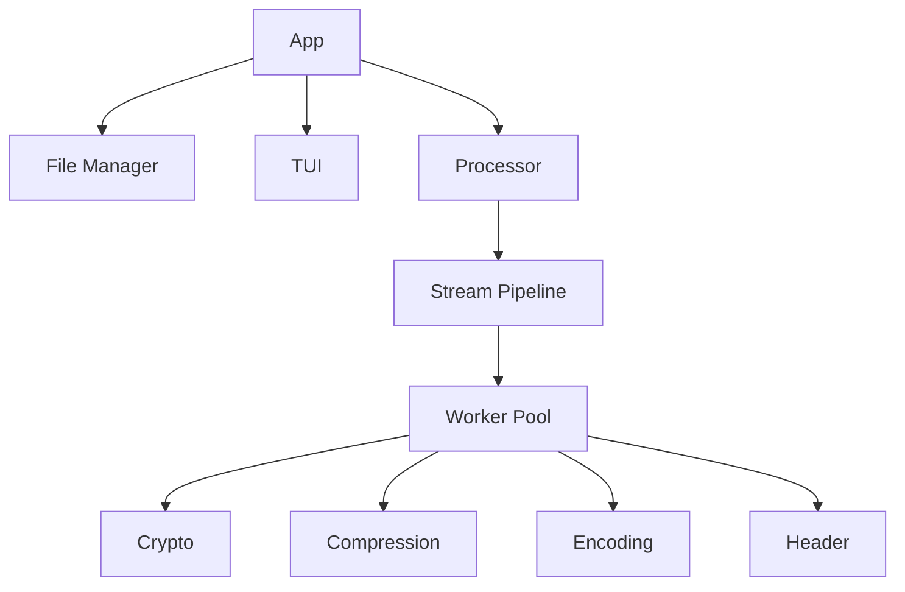

# sweetbyte-rs

A terminal-based file encryption tool built in Rust. This is a rewrite of the [Go implementation](https://github.com/hambosto/sweetbyte), maintaining full compatibility with the original file format.

## Features

- **Encryption**: AES-256-GCM and ChaCha20-Poly1305.
- **Key Derivation**: Argon2id for password hashing.
- **Compression**: DEFLATE compression to reduce file size.
- **Resilience**: Reed-Solomon error correction to handle data corruption.
- **Integrity**: HMAC-SHA256 authentication tags.
- **Interface**: Interactive TUI and command-line arguments.

## Installation

### Build from Source

```bash
git clone https://github.com/hambosto/sweetbyte-rs.git
cd sweetbyte-rs
cargo build --release
```

The binary will be in `target/release/sweetbyte-rs`.

### Install via Cargo

```bash
cargo install --path .
```

## Usage

### Interactive Mode

Run without arguments to start the interactive wizard:

```bash
sweetbyte-rs
```

This mode guides you through selecting files, entering passwords, and processing.

### CLI Mode

You can also use flags for automation (if implemented) or just rely on the interactive mode for now.

*(Note: The current implementation focuses heavily on the interactive TUI. If CLI flags are fully supported, list them here. Based on the code analysis, it seems to be primarily TUI-driven via `app::run`.)*

## Architecture

The project is modularized into several components:


```mermaid
graph TD
    A[App] --> B[File Manager]
    A --> C[TUI]
    A --> D[Processor]
    D --> E[Stream Pipeline]
    E --> F[Worker Pool]
    F --> G[Crypto]
    F --> H[Compression]
    F --> I[Encoding]
    F --> J[Header]
```

### Encryption Pipeline

Data flows through the following stages:

1.  **Compression** (DEFLATE)
2.  **Padding** (PKCS7)
3.  **AES-256-GCM**
4.  **ChaCha20-Poly1305**
5.  **Reed-Solomon Encoding**

## File Format

Files use the `.swx` extension and follow this structure:

-   **Magic Bytes**: 8 bytes for identification.
-   **Version**: 1 byte.
-   **Header**: TLV encoded, containing salt, nonce, and MAC.
-   **Body**: Encrypted chunks with optional error correction.

## Development

### Running Tests

```bash
cargo test
```

### Build

```bash
cargo build --release
```

## License

MIT License. See [LICENSE](LICENSE) for details.
